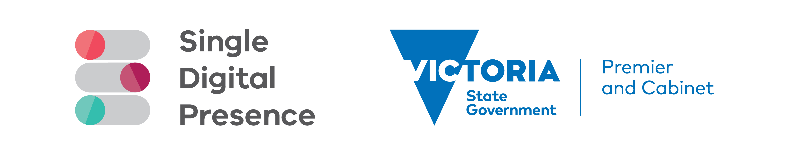
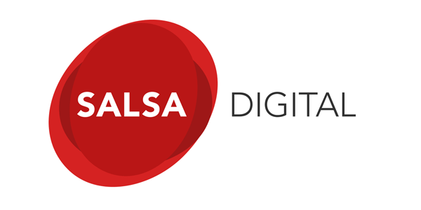

# Tide Core
Core functionality of [Tide](https://github.com/dpc-sdp/tide) distribution for [Drupal 10](https://github.com/dpc-sdp)

Tide is a Drupal 10 distribution focused on delivering an API first, headless Drupal content administration site.

[](https://circleci.com/gh/dpc-sdp/tide_core)
[](https://github.com/dpc-sdp/tide_core/releases/latest)

[](https://github.com/dpc-sdp/tide_core/blob/master/LICENSE.txt)
[](https://github.com/dpc-sdp/tide_core/pulls)

## What is in this package
- Roles
- Permissions for site administration
- Theme components discovery mechanism (if required)
- Text formats
- WYSIWYG configurations
- Common fields shared across content types
- `Topic` Taxonomy Vocabulary
- `Tags` Taxonomy Vocabulary
- `Locations` Taxonomy Vocabulary
- `Departments` Taxonomy Vocabulary

## Installation
To install this package, add this custom repository to `repositories` section of
your `composer.json`:

```json
{
  "repositories": {        
      "dpc-sdp/tide_core": {
          "type": "vcs",
          "no-api": true,
          "url": "https://github.com/dpc-sdp/tide_core.git"
      }
  }
}
```

Require this package as any other Composer package:
```bash
composer require dpc/tide_core 
``` 

## Support
[Digital Engagement, Department of Premier and Cabinet, Victoria, Australia](https://github.com/dpc-sdp) 
is a maintainer of this package.

## Contribute
[Open an issue](https://github.com/dpc-sdp) on GitHub or submit a pull request with suggested changes.

## Development and maintenance
Local development is powered by [DDEV](https://ddev.readthedocs.io/) with the
[ddev-drupal-contrib](https://github.com/ddev/ddev-drupal-contrib) add-on. The module
repository is the project root; a disposable Drupal site is built into `web/` and the
module is made available to it via per-file symlinks — code changes at the repository
root take effect immediately, no sync step required.

To start the local development stack:
1. Checkout this project.
2. Run `ddev start` — starts web, db, elasticsearch, selenium-chrome and clamav services.
3. Run `ddev poser` — installs Drupal core (version pinned by `DRUPAL_CORE` in `.ddev/config.yaml`) plus all module dependencies into `web/` and `vendor/`.
4. Run `ddev symlink-project` — symlinks this module into `web/modules/custom/tide_core` (re-run after adding/removing root-level files; also runs automatically on `ddev start`).
5. Run `ddev install-site` — installs a fresh site (`testing` profile) and enables `tide_core` and `tide_test`.

Day-to-day commands:
- `ddev drush <command>` — run Drush.
- `ddev phpunit --testsuite unit` — run PHPUnit unit tests.
- `ddev exec vendor/bin/behat --strict --colors [path/to.feature]` — run Behat tests (add `--profile=suggest` for the suggest profile).
- `ddev phpcs` / `ddev phpcbf` — lint / auto-fix coding standards.
- `ddev ssh` — shell into the web container.
 
## Related projects
- [tide](https://github.com/dpc-sdp/tide)       
- [tide_api](https://github.com/dpc-sdp/tide_api)        
- [tide_event](https://github.com/dpc-sdp/tide_event)
- [tide_landing_page](https://github.com/dpc-sdp/tide_landing_page)
- [tide_media](https://github.com/dpc-sdp/tide_media)     
- [tide_monsido](https://github.com/dpc-sdp/tide_monsido) 
- [tide_news](https://github.com/dpc-sdp/tide_news)       
- [tide_page](https://github.com/dpc-sdp/tide_page)       
- [tide_search](https://github.com/dpc-sdp/tide_search)   
- [tide_site](https://github.com/dpc-sdp/tide_site)       
- [tide_test](https://github.com/dpc-sdp/tide_test)       
- [tide_webform](https://github.com/dpc-sdp/tide_webform)  

## License
This project is licensed under [GPL2](https://github.com/dpc-sdp/tide_core/blob/master/LICENSE.txt)

## Attribution
Single Digital Presence offers government agencies an open and flexible toolkit to build websites quickly and cost-effectively.
<p align="center"><a href="https://www.vic.gov.au/what-single-digital-presence-offers" target="_blank"></a></p>

The Department of Premier and Cabinet partnered with Salsa Digital to deliver Single Digital Presence. As long-term supporters of open government approaches, they were integral to the establishment of SDP as an open source platform.
<p align="center"><a href="https://salsadigital.com.au/" target="_blank"></a></p>
