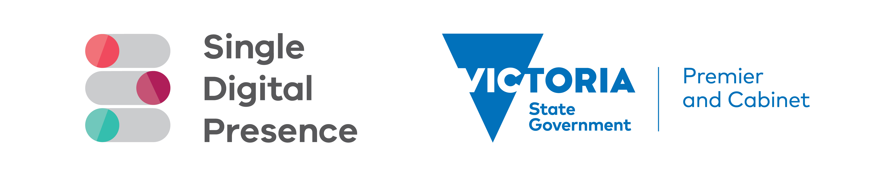
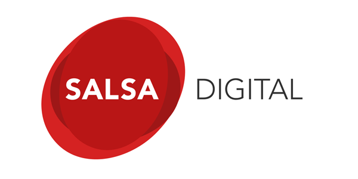

# Tide Core

Core functionality of the [Tide](https://github.com/dpc-sdp/tide) distribution
for Drupal 11.

Tide is an API-first, headless Drupal content administration platform.

[](https://circleci.com/gh/dpc-sdp/tide_core)
[](https://github.com/dpc-sdp/tide_core/releases/latest)

[](https://github.com/dpc-sdp/tide_core/blob/master/LICENSE.txt)
[](https://github.com/dpc-sdp/tide_core/pulls)

## What is in this package

- Roles and site administration permissions
- Text formats and WYSIWYG configuration
- Shared fields and paragraph types
- Content moderation workflows
- Common taxonomies including Topics, Tags, Locations and Departments

## Installation

Add the repository to your project's `composer.json`:

```json
{
  "repositories": {
    "dpc-sdp/tide_core": {
      "type": "vcs",
      "no-api": true,
      "url": "https://github.com/dpc-sdp/tide_core.git"
    }
  }
}
```

Require the package:

```bash
composer require dpc/tide_core
```

## Development and maintenance

Local development uses [DDEV](https://ddev.readthedocs.io/) and the
[ddev-drupal-contrib](https://github.com/ddev/ddev-drupal-contrib) add-on. The
module repository is the project root. A disposable Drupal site is built into
`web/`, and root files are symlinked into `web/modules/custom/tide_core`.

Build a fresh development site with:

```bash
ddev build
```

The individual build steps are:

1. `ddev start` starts the web, database, OpenSearch, Selenium Chrome and
   ClamAV services.
2. `ddev poser` installs Drupal 11.4 and project dependencies into `web/` and
   `vendor/`.
3. `ddev symlink-project` links Tide Core into the generated site.
4. `ddev install-site` installs the minimal profile and enables `tide_core` and
   `tide_test`.

Common commands:

- `ddev drush <command>` runs Drush.
- `ddev phpunit --testsuite unit` runs unit tests.
- `ddev exec vendor/bin/behat --strict --colors [path]` runs Behat tests.
- `ddev phpcs` and `ddev phpcbf` check and fix coding standards.
- `ddev ssh` opens a shell in the web container.

If OpenSearch fails its bootstrap check because `vm.max_map_count` is too low,
inspect it with `ddev logs -s opensearch`, then increase the Docker host
limit and restart DDEV:

```bash
docker run --privileged --rm --pid=host alpine sysctl -w vm.max_map_count=262144
ddev start
```

## Support and contributing

[Digital Engagement, Department of Premier and Cabinet, Victoria, Australia](https://github.com/dpc-sdp)
maintains this package. Open an issue or submit a pull request on GitHub to
propose a change.

## Related projects

- [Tide](https://github.com/dpc-sdp/tide)
- [Tide API](https://github.com/dpc-sdp/tide_api)
- [Tide Event](https://github.com/dpc-sdp/tide_event)
- [Tide Landing Page](https://github.com/dpc-sdp/tide_landing_page)
- [Tide Media](https://github.com/dpc-sdp/tide_media)
- [Tide News](https://github.com/dpc-sdp/tide_news)
- [Tide Search](https://github.com/dpc-sdp/tide_search)
- [Tide Site](https://github.com/dpc-sdp/tide_site)
- [Tide Webform](https://github.com/dpc-sdp/tide_webform)

## License

This project is licensed under [GPL 2](https://github.com/dpc-sdp/tide_core/blob/master/LICENSE.txt).

## Attribution

Single Digital Presence offers government agencies an open and flexible toolkit
to build websites quickly and cost-effectively.

<p align="center"><a href="https://www.vic.gov.au/what-single-digital-presence-offers" target="_blank"></a></p>

The Department of Premier and Cabinet partnered with Salsa Digital to deliver
Single Digital Presence. As long-term supporters of open government approaches,
they were integral to establishing SDP as an open source platform.

<p align="center"><a href="https://salsadigital.com.au/" target="_blank"></a></p>
