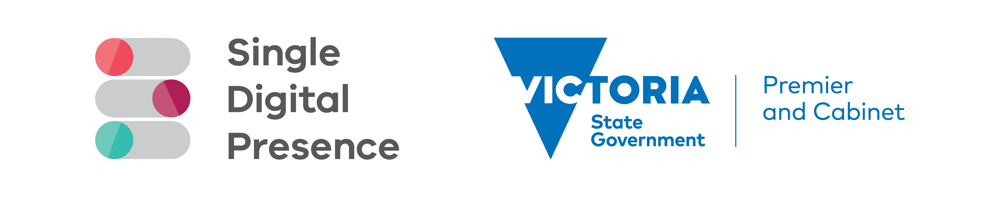
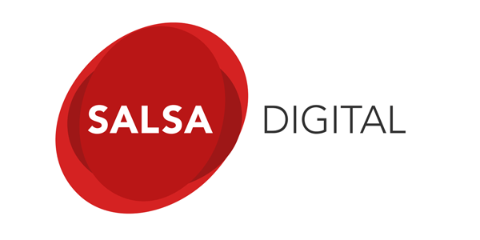

# Tide API
Content API functionality of [Tide](https://github.com/dpc-sdp/tide) distribution

[](https://circleci.com/gh/dpc-sdp/tide_api)

## Tide
Tide is a Drupal 8 distribution focused on delivering an API first, headless
Drupal content administration site.

# CONTENTS OF THIS FILE

* Introduction
* Requirements
* Recommended Modules
* Installation

# INTRODUCTION
The Tide API module provides the content API functionality and related
configurations. This module is required in case you want to use your site in a
headless manner.

## Redirects
This module introduces a wildcard redirect feature. Redirects using the
Redirects module can be added with a `%` at the end in order to create wildcard
redirects. E.g. `/my-path%` will match `/my-path-title`,
`my-path/sub-folder/path` and `/my-path-other-title`.

# REQUIREMENTS
* [Tide Core](https://github.com/dpc-sdp/tide_core)
* [JSON:API](https://drupal.org/project/jsonapi)
* [JSON:API Extras](https://drupal.org/project/jsonapi_extras)
* [Open API](https://drupal.org/project/openapi)
* [Schemata](https://drupal.org/project/schemata)

# INSTALLATION
Include the Tide API module in your composer.json file
```bash
composer require dpc-sdp/tide_api
```

## Development and maintenance
Development is powered by [Dev-Tools](https://github.com/dpc-sdp/dev-tools). Please refer to Dev-Tools'
page for [system requirements](https://github.com/dpc-sdp/dev-tools/#prerequisites) and other details.

To start local development stack:
1. Checkout this project
2. Ensure other projects using our dev stack are stopped
3. Run `./dev-tools.sh`
4. Run `ahoy build`
5. Use `ahoy login` to gain access to the CMS (or use the one time login link given at end of build)
6. Use `ahoy lint && ahoy test-behat` to run CI tests

# Caveats

Tide API is on the alpha release, use with caution. APIs are likely to change
before the stable version, that there will be breaking changes and that we're
not supporting it for external production sites at the moment.

# Attribution
Single Digital Presence offers government agencies an open and flexible toolkit to build websites quickly and cost-effectively.
<p align="center"><a href="https://www.vic.gov.au/what-single-digital-presence-offers" target="_blank"></a></p>

The Department of Premier and Cabinet partnered with Salsa Digital to deliver Single Digital Presence. As long-term supporters of open government approaches, they were integral to the establishment of SDP as an open source platform.
<p align="center"><a href="https://salsadigital.com.au/" target="_blank"></a></p>

